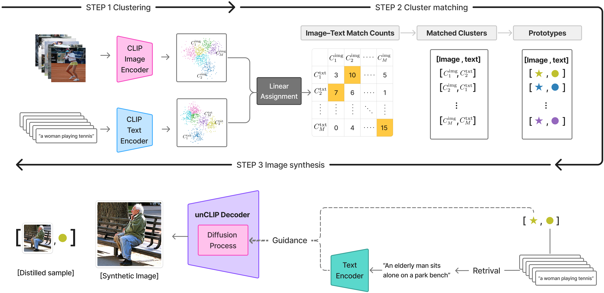

# Multimodal Dataset Distillation Made Simple by Prototype-guided Data Synthesis

Official PyTorch implementation of the ICLR 2026 paper:
"Multimodal dataset distillation made simple by prototype-guided data synthesis" 

<p align="center">
    
</p>

## Abstract 
Recent advances in multimodal learning have achieved remarkable success across diverse vision–language tasks. However, such progress heavily relies on large-scale image–text datasets, making training costly and inefficient. Prior efforts in dataset filtering and pruning attempt to mitigate this issue, but still require relatively large subsets to maintain performance and fail under very small subsets. Dataset distillation offers a promising alternative, yet existing multimodal dataset distillation methods require full-dataset training and joint optimization of pixel and text features, making them architecture-dependent and limiting cross-architecture generalization. To overcome this, we propose a learning-free dataset distillation framework that eliminates the need for large-scale training and optimization while enhancing generalization across architectures. Our method uses CLIP to extract aligned image–text embeddings, obtains prototypes, and employs an unCLIP decoder to synthesize images, enabling efficient and scalable multimodal dataset distillation. Extensive experiments demonstrate that our approach consistently outperforms optimization-based dataset distillation and subset selection methods, achieving state-of-the-art cross-architecture generalization.


## Installation

Python 3.9 is required.

```bash
pip install -r requirements.txt
```


## Datasets

Download the Flickr30K 
[[Train](https://storage.googleapis.com/sfr-vision-language-research/datasets/flickr30k_train.json)]
[[Val](https://storage.googleapis.com/sfr-vision-language-research/datasets/flickr30k_val.json)]
[[Test](https://storage.googleapis.com/sfr-vision-language-research/datasets/flickr30k_test.json)]
[[Images](https://www.kaggle.com/datasets/hsankesara/flickr-image-dataset)]
and MS-COCO
[[Train](https://storage.googleapis.com/sfr-vision-language-research/datasets/coco_karpathy_train.json)]
[[Val](https://storage.googleapis.com/sfr-vision-language-research/datasets/coco_karpathy_val.json)]
[[Test](https://storage.googleapis.com/sfr-vision-language-research/datasets/coco_karpathy_test.json)]
[[Images](https://cocodataset.org/#download)]
datasets. 

Place the downloaded images and annotation JSON files as follows:

```
./data/datasets/
├── Flickr30k/
│   ├── flickr30k-images/
│   │   ├── 0.jpg
│   │   ├── 1.jpg
│   │   └── ...
│   ├── flickr30k_train.json
│   ├── flickr30k_val.json
│   └── flickr30k_test.json
└── COCO/
    ├── train2014/
    ├── val2014/
    ├── test2014/
    ├── coco_karpathy_train.json
    ├── coco_karpathy_val.json
    └── coco_karpathy_test.json
```

## Run

### Flickr30K
To distill the Flickr30K dataset into 100 pairs and evaluate the distilled dataset, use the following scripts:

```
python pds_distill.py --mode distill --dataset flickr --data_root './data/datasets/Flickr30k' --num_pairs 100 
python pds_distill.py --mode eval --dataset flickr --data_root './data/datasets/Flickr30k' --num_pairs 100 
```

### MS-COCO
To distill the MS-COCO dataset into 100 pairs and evaluate the distilled dataset, use the following scripts:

```
python pds_distill.py --mode distill --dataset coco --data_root './data/datasets/COCO' --num_pairs 100   
python pds_distill.py --mode eval --dataset coco --data_root './data/datasets/COCO' --num_pairs 100  
```

## Citation

If you find this work useful, please cite:

```bibtex
@inproceedings{choi2026pds,
  title={Multimodal Dataset Distillation Made Simple by Prototype-guided Data Synthesis},
  author={Junhyeok Choi and Sangwoo Mo and Minwoo Chae},
  booktitle={International Conference on Learning Representations (ICLR)},
  year={2026}
}
```


## Acknowledgement
The implementation and experiments are built upon the code of [LoRS](https://github.com/silicx/LoRS_Distill).
